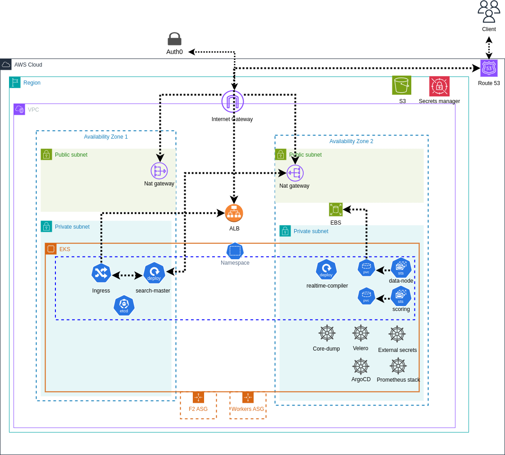

# Hyperspace Terraform Module


## Overview

This Terraform module provides a complete infrastructure setup for the Hyperspace project, including EKS cluster deployment, networking, security configurations, and various application components.
The module is split into two main parts:
- Infrastructure Module (`Infra-module`)
- Application Module (`app-module`)

## Architecture

The module creates a production-ready infrastructure with:

- Amazon EKS cluster with managed and self-managed node groups
- VPC with public and private subnets
- AWS Load Balancer Controller
- Internal and external ingress controllers
- Monitoring stack (Prometheus, Grafana, Loki)
- Backup solution (Velero)
- GitOps with ArgoCD
- Terraform Cloud Agent for remote operations

## Prerequisites

- Terraform >= 1.0.0
- AWS CLI configured with admin access
- kubectl installed
- Helm 3.x
- AWS account with admin access
- Domain name (for Route53 setup)
- Terraform cloud account

## Module Structure 
```
.
├── Infra-module/
│ ├── eks.tf # EKS cluster configuration
│ ├── network.tf # VPC and networking setup
│ ├── S3.tf # S3 buckets configuration
│ ├── tfc_agent.tf # Terraform Cloud agent setup
│ ├── variables.tf # Input variables
│ ├── outputs.tf # Output values
│ ├── locals.tf # Local variables
│ ├── providers.tf # Provider configuration
│ └── user_data.sh.tpl # User data for EC2 instances
├── app-module/
│ ├── argocd.tf # ArgoCD installation
│ ├── loki.tf # Logging stack
│ ├── velero.tf # Backup solution
│ ├── Route53.tf # DNS configuration
│ ├── variables.tf # Input variables
│ └── providers.tf # Provider configuration
```


### Infrastructure Module Variables

| Name | Description | Type | Default | Required |
|------|-------------|------|---------|----------|
| project | Name of the project | string | "hyperspace" | no |
| environment | Deployment environment | string | "development" | no |
| aws_region | AWS region | string | "us-east-1" | no |
| vpc_cidr | CIDR block for VPC | string | - | yes |
| availability_zones | List of AZs | list(string) | [] | no |
| create_vpc_flow_logs | Enable VPC flow logs | bool | false | no |
| enable_nat_gateway | Enable NAT Gateway | bool | true | no |
| single_nat_gateway | Use single NAT Gateway OR one per AZ | bool | false | no |
| num_zones | Number of AZs to use | number | 2 | no |
| create_vpc_flow_logs | Create VPC flow logs | bool | false | no |
| flow_logs_retention | Flow logs retention in days | number | 14 | no |
| flow_log_group_class | Flow logs log group class in CloudWatch | string | "" | no |
| flow_log_file_format | Flow logs file format | string | "" | no |
| create_eks | Create EKS cluster | bool | true | no |
| worker_nodes_max | Maximum number of worker nodes | number | - | yes |
| worker_instance_type | List of allowed instance types | list(string) | ["m5n.xlarge"] | no |


### Application Module Variables

| Name | Description | Type | Default | Required |
|------|-------------|------|---------|----------|
| organization | Terraform Cloud organization name | string | - | yes |
| infra_workspace_name | Infrastructure workspace name | string | - | yes |
| domain_name | Main domain name for sub-domains | string | "" | no |
| enable_argocd | Enable ArgoCD installation | bool | true | no |
| enable_ha_argocd | Enable HA for ArgoCD | bool | true | no |
| create_public_zone | Create public Route53 zone | bool | false | no |
| enable_cluster_autoscaler | Enable cluster autoscaler | bool | true | no |

## Outputs

### Infrastructure Module Outputs

| Name | Description |
|------|-------------|
| aws_region | The AWS region where resources are deployed |
| eks_cluster | Complete EKS cluster object |
| vpc | Complete VPC object |
| tags | Map of tags applied to resources |
| s3_buckets | Map of S3 buckets created |

### Application Module Outputs
The application module primarily manages Kubernetes resources and doesn't expose specific outputs.


## Features

### EKS Cluster
- Managed node groups with Bottlerocket OS
- Self-managed node groups for specialized workloads
- Cluster autoscaling
- IRSA (IAM Roles for Service Accounts)
- EBS CSI Driver integration
- EKS Managed Addons

### Networking
- VPC with public and private subnets
- NAT Gateways
- VPC Endpoints
- Internal and external ALB ingress controllers
- Network policies
- VPC flow logs (optional)
- Connectivity to Auth0

### Security
- Network policies
- Security groups
- IAM roles and policies
- OIDC integration

### Monitoring and Logging
- Prometheus and Grafana
- Loki for log aggregation
- OpenTelemetry for observability
- CloudWatch integration
- Core dump handling

### Backup and Disaster Recovery
- Velero for cluster backup
- EBS volume snapshots

### GitOps and CI/CD
- ArgoCD installation and SSO integration
- ECR credentials sync to gain access to private hyperspace ECR repositories
- Terraform Cloud Agent to gain access to private EKS cluster

## Outputs

### Infrastructure Module Outputs

| Name | Description |
|------|-------------|
| aws_region | The AWS region where resources are deployed |
| eks_cluster | Complete EKS cluster object |
| vpc | Complete VPC object |
| tags | Map of tags applied to resources |
| s3_buckets | Map of S3 buckets created |

### Application Module Outputs
The application module primarily manages Kubernetes resources and doesn't expose specific outputs.

> **Note**: This module is currently under active development and may undergo significant changes. Not all features are fully implemented yet.


# Getting Started

- Create a new workspace in Terraform Cloud
- Name it according to your infrastructure needs (e.g., "hyperspace-infra-module")

- Create a new Terraform configuration and use the module as follows:

```hcl
module "hyperspace" {
  source = "github.com/hyper-space-io/Hyperspace-terraform-module/Infra-module?ref=setup-cluster-tools"
  
  # Required variables
  domain_name         = "your-domain.com"
  environment         = "development"
  vpc_cidr            = "10.0.0.0/16"
  worker_nodes_max    = 10
  
  # Optional variables with defaults
  project               = "hyperspace"
  aws_region            = "us-east-1"
  create_public_zone    = true
  enable_ha_argocd      = true
  worker_instance_type  = ["m5n.xlarge"]
  
  # Additional configurations
  flow_log_group_class = "INFREQUENT_ACCESS"
  dex_connectors       = [] # Add your authentication connectors here
}
```

## Important Notes

1. **ACM Certificate Validation**: During the first deployment, the process will pause for ACM certificate validation. You will need to:
   - Get the ACM validation records from the AWS Console
   - Add these CNAME records to your domain's DNS settings
   - Wait for the certificates to be validated (typically 5-30 minutes)
   - The deployment will automatically continue once validation is complete

2. **Access Your Infrastructure**: After successful deployment, you can access:
   - ArgoCD: `https://argocd.internal-<environment>.<your-domain>`
   - Grafana: `https://grafana.internal-<environment>.<your-domain>`

3. **Initial ArgoCD Password**: Retrieve it using:
   ```bash
   kubectl -n argocd get secret argocd-initial-admin-secret -o jsonpath="{.data.password}" | base64 -d
   ```

4. **Terraform Cloud Agent**: The Terraform Cloud Agent is deployed to the VPC created by the infrastructure module and is used to manage the app-module.

5. **Terraform cloud token**: In order to manage the app-module from the Infra-module, you need to add the Terraform cloud token to the Infra-module, add a variable called `TFE_TOKEN` and set it to your Terraform cloud token generated from the Terraform Cloud UI in: settings -> API tokens.

For detailed configuration options, refer to the module variables documentation above.